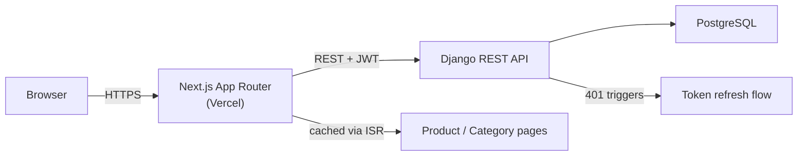

# Oghie Store — Storefront

A headless ecommerce storefront built with Next.js, backed by a custom Django REST API. Built to explore a decoupled commerce architecture end-to-end — auth, cart/checkout flow, product filtering, and a design system built around a quiet-luxury visual identity rather than a default theme.

---

## Stack


## Features

- Server-rendered product catalog with ISR, filtered by category, price range, rating, and availability
- Cart drawer (not a page redirect) with quantity steppers and a free-shipping progress indicator
- JWT-based auth with automatic access-token refresh
- Wishlist and product reviews
- Mega-menu navigation built on Radix primitives
- Design system with a defined color/type token set rather than framework defaults

## Architecture



**Auth flow:** access token held in memory, refresh handled transparently by a shared fetch wrapper (`src/lib/api/client.ts`) — a 401 triggers one silent refresh-and-retry before falling back to logout.

## Getting started

```bash
git clone https://github.com/oghenenoghie/oghie-kwd-store.git
cd oghie-kwd-store
npm install
cp .env.example .env.local
npm run dev
```

### Environment variables

```bash
# .env.example
NEXT_PUBLIC_API_BASE_URL=https://oghie-store.vercel.app
```

## Scripts

| Command | Description |
|---|---|
| `npm run dev` | Start local dev server |
| `npm run build` | Production build |
| `npm run lint` | ESLint |
| `npm run typecheck` | TypeScript check with no emit |

## Design system

Design tokens (color palette, type scale, component/library choices) live in
`.claude/skills/ecommerce-storefront-design/SKILL.md` and are wired into
`src/app/globals.css` via Tailwind's `@theme`. Treat that file as the source
of truth before introducing new colors, fonts, or UI libraries.

## Project structure

```
src/
  app/            App Router routes, layout, providers
  components/     layout (header/footer/nav), cart, product, home, ui
  hooks/          auth, cart, cart-drawer, scroll state
  lib/api/        fetch client, JWT refresh, typed endpoint helpers
```

## What's next

- Wire real product imagery (currently placeholder blocks) once a media pipeline (Cloudinary/imgix or Django-side) is in place
- Confirm exact field-level shapes for the cart/checkout endpoints against the live DRF API — current types are best-effort from the route map
- Add Playwright coverage for the checkout flow, plus optimistic UI for cart/wishlist mutations
- Product detail page (`/products/[slug]`), account pages, and CMS-driven homepage sections via `/api/cms/sections/`

## License

MIT
